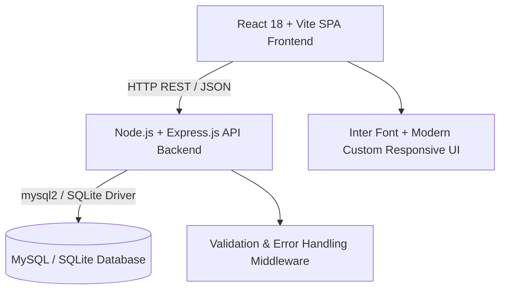
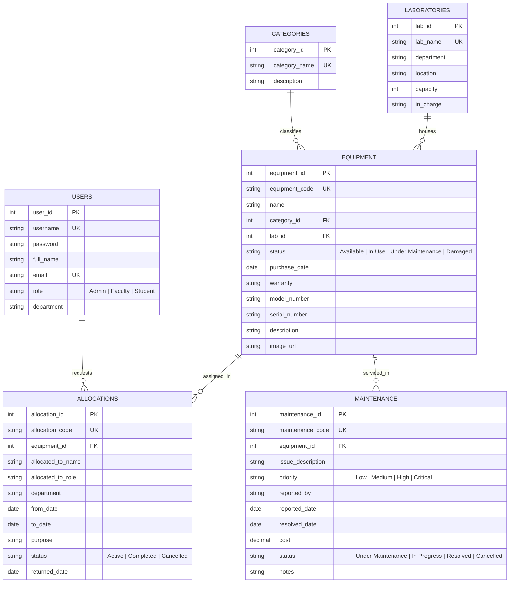

# Project - 9: College Laboratory Equipment Management System (Lab EMS)

A full-stack web application designed for academic institutions to streamline the tracking, allocation, maintenance, and status reporting of laboratory equipment across various engineering departments.

---

## 📖 Scenario & Problem Statement

College laboratories contain hundreds of critical physical and digital assets, including desktop workstations, networking switches, oscilloscopes, function generators, printers, projectors, and specialized software licenses.

### Key Challenges of Manual Management:
- Lack of centralized visibility into equipment availability and current operational condition.
- Difficulties in tracking equipment allocations across departments and faculty members.
- Delay in logging damage reports, scheduling technician repairs, and recording maintenance costs.
- Inability to generate aggregate utilization reports by department or category for audit and budgeting.

**Solution:** **Lab EMS** provides an intuitive, real-time dashboard and centralized system enabling faculty and administrators to inspect, allocate, service, and report on laboratory equipment efficiently.

---

## 🛠️ Technology Stack



### 1. Frontend
- **React 18 (Vite):** Fast, modern Single-Page Application (SPA) architecture.
- **Modern JavaScript (ES6+):** Async/Await, Array destructuring, arrow functions.
- **React Hooks:** `useState` for local component state, `useEffect` for lifecycle data fetching and dynamic reactivity.
- **Array Processing:** Dynamic list rendering with `.map()` and real-time multi-criteria filtering with `.filter()`.
- **Lucide Icons:** Crisp vector icons for navigation, KPI cards, and operational status.
- **Custom CSS:** Pixel-accurate design matching institution dashboards with custom SVG Charts (Donut & Bar).

### 2. Backend
- **Node.js & Express.js:** Fast and scalable asynchronous REST API server.
- **Express Validator:** Request payload validation middleware.
- **CORS & JSON Middleware:** Secure cross-origin requests and structured responses.
- **Centralized Error Handling:** Consistent error payloads with status codes.

### 3. Database
- **MySQL / SQLite Dual Compatibility:**
  - Complete MySQL DDL (`schema.sql`) with tables, foreign keys, cascade rules, and seed records.
  - Zero-configuration local fallback for seamless plug-and-play evaluation.
  - Advanced SQL queries demonstrating `INNER JOIN`, `LEFT JOIN`, `UPDATE`, `DELETE`, `COUNT`, and `GROUP BY`.

---

## 🗄️ Database Schema & Entities

The relational database consists of 6 interconnected tables:



---

## 📊 SQL Query Demonstrations (JOIN, UPDATE, DELETE, COUNT, GROUP BY)

All queries are located in [`backend/database/queries.sql`](file:///c:/Users/naruj/OneDrive/Documents/New%20folder/backend/database/queries.sql).

### 1. Multi-Table `INNER JOIN` (Equipment Catalog)
```sql
SELECT 
    e.equipment_id,
    e.equipment_code,
    e.name AS equipment_name,
    c.category_name,
    l.lab_name,
    l.location,
    l.in_charge,
    e.status,
    e.purchase_date,
    e.warranty
FROM equipment e
INNER JOIN categories c ON e.category_id = c.category_id
INNER JOIN laboratories l ON e.lab_id = l.lab_id
ORDER BY e.equipment_code ASC;
```

### 2. `GROUP BY` & `COUNT` with Conditional Aggregation (Laboratory Utilization Report)
```sql
SELECT 
    l.lab_name AS laboratory,
    COUNT(e.equipment_id) AS total_equipment,
    SUM(CASE WHEN e.status = 'Available' THEN 1 ELSE 0 END) AS available,
    SUM(CASE WHEN e.status = 'In Use' THEN 1 ELSE 0 END) AS in_use,
    SUM(CASE WHEN e.status = 'Under Maintenance' THEN 1 ELSE 0 END) AS under_maintenance,
    SUM(CASE WHEN e.status = 'Damaged' THEN 1 ELSE 0 END) AS damaged
FROM laboratories l
LEFT JOIN equipment e ON l.lab_id = e.lab_id
GROUP BY l.lab_id, l.lab_name
ORDER BY total_equipment DESC;
```

### 3. `UPDATE` Query (Status Lifecycle Transition)
```sql
-- Update equipment to Under Maintenance on damage report
UPDATE equipment 
SET status = 'Under Maintenance', updated_at = CURRENT_TIMESTAMP 
WHERE equipment_id = 5;

-- Mark maintenance resolved
UPDATE maintenance 
SET status = 'Resolved', resolved_date = CURRENT_DATE, cost = 1500.00, notes = 'Part replaced successfully'
WHERE maintenance_id = 1;
```

### 4. `DELETE` Query (Safe Record Cleanup)
```sql
DELETE FROM allocations WHERE allocation_id = 4;
```

---

## 🚀 Installation & Running Instructions

### Prerequisites
- **Node.js** (v18.x or higher)
- **npm** (v9.x or higher)
- *(Optional)* MySQL Server 8.0+

### One-Command Quick Start

1. **Clone or Navigate to the project root:**
   ```bash
   cd "College Laboratory Equipment Management System"
   ```

2. **Run the development environment:**
   ```bash
   npm run dev
   ```
   *This starts both the backend API server on port `5000` and the Vite React frontend on port `3000`.*

3. **Access the application:**
   - **Frontend UI:** [http://localhost:3000](http://localhost:3000)
   - **Backend API:** [http://localhost:5000/api/health](http://localhost:5000/api/health)

### Demo Credentials

| Role | Username | Password | Access Level |
| :--- | :--- | :--- | :--- |
| **Admin** | `admin` | `admin123` | Full Institutional Control, Inventory CRUD, Lab Configuration, Analytics |
| **Faculty (CSE)** | `faculty1` | `faculty123` | Equipment Reservation, Damage Ticketing, Lab Practical Apparatus Access |
| **Faculty (ECE)** | `faculty2` | `faculty123` | Department Allocations & Maintenance Reporting |

---

## 📡 REST API Documentation

| Method | Endpoint | Description |
| :--- | :--- | :--- |
| `POST` | `/api/auth/login` | Authenticate Admin / Faculty and issue session token |
| `GET` | `/api/equipment` | Search & filter equipment catalog |
| `GET` | `/api/equipment/:id` | Detailed equipment specifications and history |
| `POST` | `/api/equipment` | Register new equipment (Admin) |
| `PUT` | `/api/equipment/:id` | Update equipment metadata |
| `DELETE` | `/api/equipment/:id` | Remove equipment record |
| `GET` | `/api/equipment/stats/summary` | Get aggregated KPI counts for dashboard |
| `GET` | `/api/allocations` | List all active and completed equipment allocations |
| `POST` | `/api/allocations` | Allocate equipment to faculty / department |
| `PUT` | `/api/allocations/:id/return` | Mark equipment returned and set status to Available |
| `GET` | `/api/maintenance` | List all maintenance and repair tickets |
| `POST` | `/api/maintenance/report` | Log damaged equipment and move to Under Maintenance |
| `PUT` | `/api/maintenance/:id/status` | Update repair status and costs |
| `GET` | `/api/reports/by-laboratory` | Aggregated report grouped by lab |
| `GET` | `/api/reports/by-category` | Aggregated report grouped by category |
| `GET` | `/api/reports/maintenance-summary`| Breakdown of maintenance costs and ticket statuses |
| `GET` | `/api/users` | List registered faculty and administrators |
| `POST` | `/api/users` | Register new faculty or administrator account |
| `DELETE` | `/api/users/:id` | Delete faculty account |

---

## 🌿 Git & GitHub Development Workflow

- **Branching Strategy:**
  - `main`: Stable release branch.
  - `develop`: Integration branch.
  - `feature/equipment-crud`: Equipment registration and editing module.
  - `feature/allocations`: Allocation and return workflow.
  - `feature/maintenance-reporting`: Damage ticketing and resolution.
  - `feature/reports-aggregation`: SQL GROUP BY report generation.
- **GitHub Issues & PRs:** All features developed via feature branches with structured pull request checklists and review templates.
